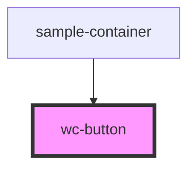

# wc-button

<!-- Auto Generated Below -->

## Properties

| Property   | Attribute   | Description                          | Type                                     | Default     |
| ---------- | ----------- | ------------------------------------ | ---------------------------------------- | ----------- |
| `block`    | `block`     | fit button width to its parent width | `boolean`                                | `undefined` |
| `disabled` | `disabled`  | button disabled                      | `boolean`                                | `undefined` |
| `htmlType` | `html-type` | html button type                     | `"button" \| "submit"`                   | `undefined` |
| `loading`  | `loading`   | show loading icon                    | `boolean`                                | `undefined` |
| `size`     | `size`      | size of button                       | `"base" \| "lg" \| "sm" \| "xl" \| "xs"` | `undefined` |
| `theme`    | `theme`     | theme of button                      | `"primary" \| "secondary"`               | `undefined` |

## Events

| Event     | Description      | Type               |
| --------- | ---------------- | ------------------ |
| `clicked` | click event emit | `CustomEvent<any>` |

## Dependencies

### Used by

 - [sample-container](../../containers/sample-container)

### Graph

----------------------------------------------

*Built with [StencilJS](https://stenciljs.com/)*
