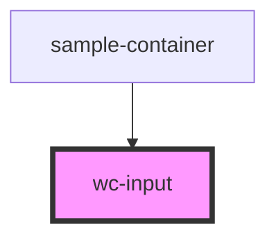

# wc-input

<!-- Auto Generated Below -->

## Properties

| Property      | Attribute     | Description          | Type      | Default     |
| ------------- | ------------- | -------------------- | --------- | ----------- |
| `disabled`    | `disabled`    | input disabled       | `boolean` | `undefined` |
| `label`       | `label`       | label of input       | `string`  | `undefined` |
| `name`        | `name`        | name of input        | `string`  | `undefined` |
| `placeholder` | `placeholder` | placeholder of input | `string`  | `undefined` |
| `value`       | `value`       | value of input       | `string`  | `undefined` |

## Events

| Event         | Description      | Type                  |
| ------------- | ---------------- | --------------------- |
| `changeValue` | click event emit | `CustomEvent<string>` |

## Dependencies

### Used by

 - [sample-container](../../containers/sample-container)

### Graph

----------------------------------------------

*Built with [StencilJS](https://stenciljs.com/)*
