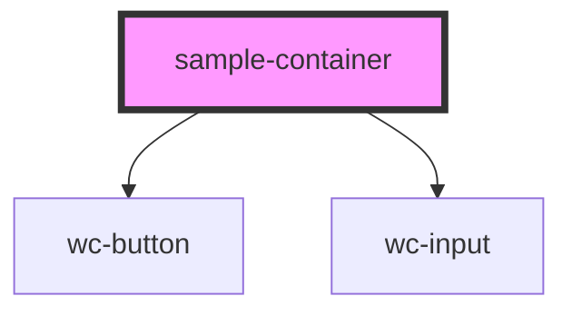

# sample-container

<!-- Auto Generated Below -->

## Methods

### `handleClicked() => Promise<void>`

click event

#### Returns

Type: `Promise<void>`

### `handleInput(event: CustomEvent<string>) => Promise<void>`

input event

#### Returns

Type: `Promise<void>`

## Dependencies

### Depends on

- [wc-button](../../components/wc-button)
- [wc-input](../../components/wc-input)

### Graph

----------------------------------------------

*Built with [StencilJS](https://stenciljs.com/)*
